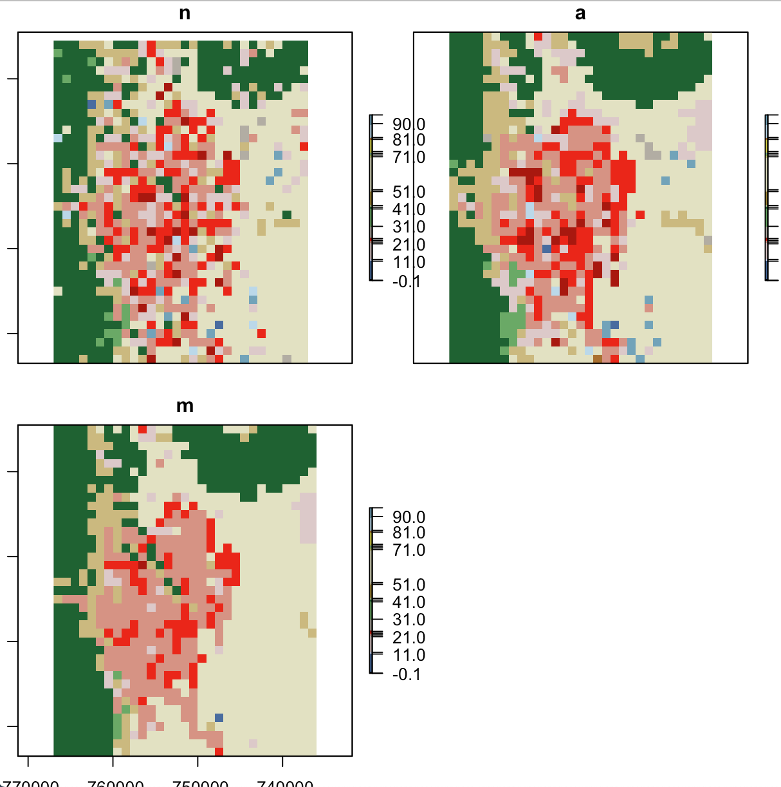

# Resampling in R

[](https://travis-ci.com/mikejohnson51/resample)

This code is part of a working paper focused on resampling strategies for catigorical data.

The basic workflow is as follows:

```{r}

# Start with a native high resolution dataset
nlcd = raster("./nlcd_2011_landcover_2011_edition_2014_10_10.img")

# Define an Area of Interest
AOI = AOI::aoi_get("Colorado Springs") %>%
  st_transform(nlcd@crs)
  
output = prep_output(AOI)
input = crop(nlcd, output, snap = "out")

leaflet() %>% addTiles() %>% addPolygons(data = AOI)

## Nearest Neighbor
n = resampleData(input, output, method = 'nn')

## Areal Porportioning
a = resampleData(input, output, 0, method = 'area')

## Majority Rule
m = resampleData(input, output, 0, method = 'maj')

b = brick(n,a,m) %>% setNames(c("Nearest Neighbor", "Areal", "Majority Rule"))

plot(b, breaks = col_lu$nlcd.code, col = col_lu$color)

```



