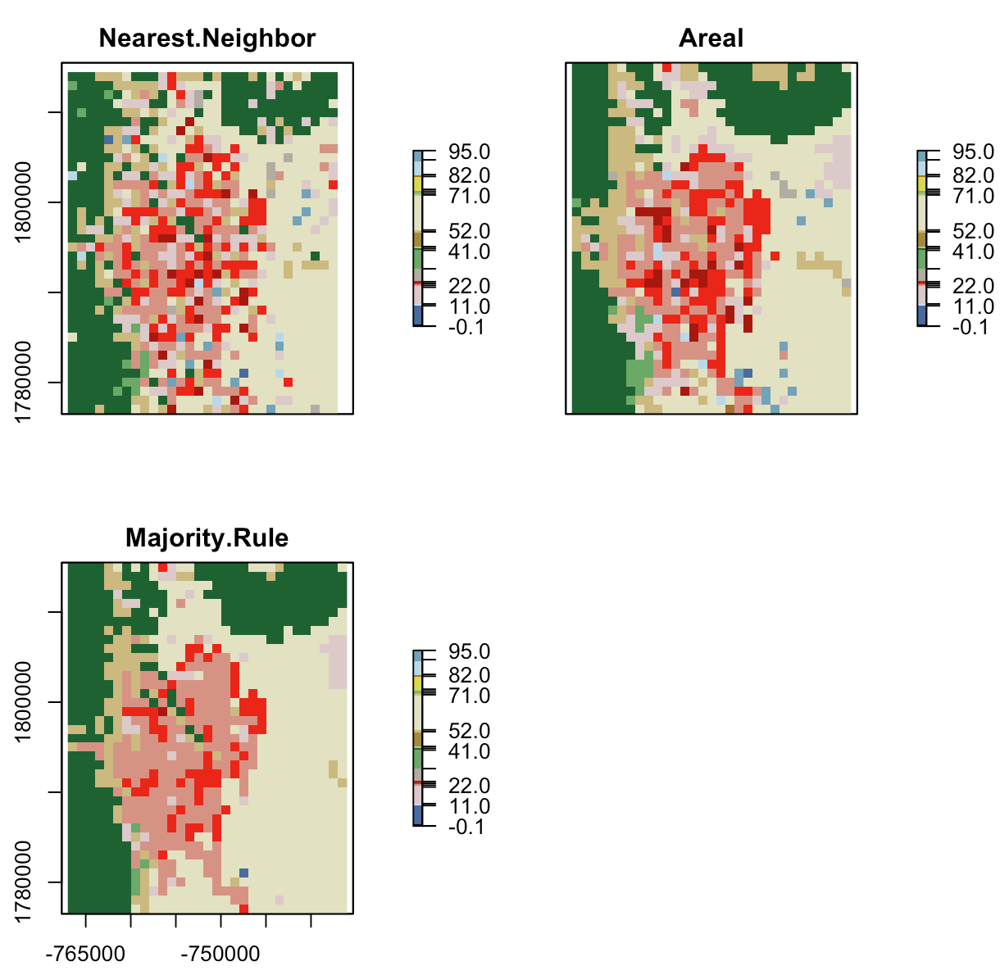

# Resampling in R

This code is part of a working paper focused on resampling strategies for Hydrologic Models.

The basic workflow is as follows:

```{r}

nlcd = raster("./nlcd_2011_landcover_2011_edition_2014_10_10.img")

AOI = AOI::getAOI("Colorado Springs") %>%
  st_transform(nlcd@crs)


input = crop(nlcd, AOI, snap = 'out')
output = prep_output(input)
n = resampleData(input, output, 0, method = 'nn')
a = resampleData(input, output, 0, method = 'area')
m = resampleData(input, output, 0, method = 'maj')

b = brick(n,a,m) %>% setNames(c("n", "a", "m"))

plot(b, breaks = col_lu$nlcd.code, col = col_lu$color)


```



