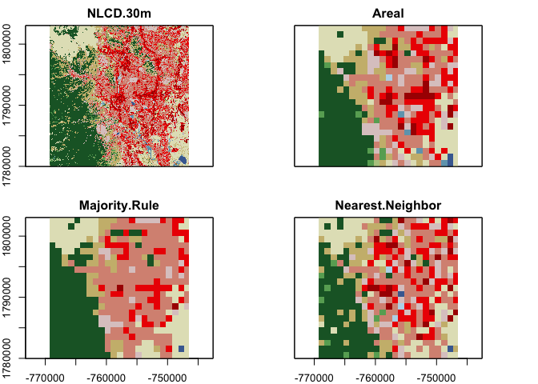

<!-- README.md is generated from README.Rmd. Please edit that file -->

# resample

<!-- badges: start -->

[](https://travis-ci.com/mikejohnson51/resample)
<!-- badges: end -->

This code is part of a working paper focused on resampling strategies
for categorical data. The premise is that the defacto industry standards
of majority rule and nearest neighbor give rise to competing objectives
with respect to preserving map structure and map level class
proportions.

## Installation

You can install the development version from
[GitHub](https://github.com/) with:

``` r
# install.packages("devtools")
devtools::install_github("mikejohnson51/resample")
```

## Example

To define a minimal example:

1.  Lets load our spatial/visualization packages,
2.  Read in the 30 meter resolution, 2016 CONUS National Land Cover
    Dataset
3.  Define an area of interest (AOI) around Colorado Springs, and
    re-project
4.  and crop the NLCD to this boundary

``` r
library(resample)

library(raster)
library(sf)
library(ggplot2)

# Start with a native high resolution dataset
nlcd = brick(nlcd_conus_path)

# Define an Area of Interest and transform to NLCD CRS
AOI = AOI::aoi_get(list("Colorado Springs", 21, 21), km = TRUE) %>% 
  st_transform(nlcd@crs)

input  = crop(nlcd, AOI, snap = "out")
```

Three resampling techniques are highlighted which include nearest
neighbor, majority rule and a new method that seeks to preserve both
areal proportions and map structure. Nearest neighbor and majority rule
utilize GDAL `near` and `mode` resampling.

For each method, an input raster and desired cell size must be provided,
cell size is given with respect to the input raster CRS. In our example
this is meters (see below). This is the same principle as the `-tr` flag
found in GDAL utilities.

``` r
st_crs(input)$units
#> [1] "m"
```

### (1) Nearest Neighbor

``` r
## Nearest Neighbor
system.time({
  n = resampleData(input, cellsize = 1000, method = 'nn')
})
#>    user  system elapsed 
#>   0.287   0.060   0.369
```

### (2) Majority Rule

``` r
## Majority Rule
system.time({
  m = resampleData(input, cellsize = 1000,  method = 'maj')
})
#>    user  system elapsed 
#>   0.891   0.065   1.287
```

### (3) Area Preservation

``` r
## Areal Proportion
system.time({
  a = resampleData(input, cellsize = 1000,  method = 'area')
})
#>    user  system elapsed 
#>   0.423   0.055   0.539
```

### Visualize

Here is a quick view of the maps produced by each method:

``` r
b = brick(n,m,a) %>% 
  resample(input, method = "ngb") %>% 
  addLayer(input) %>% 
  setNames(c("Nearest Neighbor", "Majority Rule", "Areal", "NLCD 30m"))  

plot(b[[c(4,3,2,1)]], 
     breaks = col_lu$nlcd.code, 
     col = col_lu$color, 
     legend = F)
```



### Disagreement across methods

Overall, we can see that \~46% of the cell, the three methods assigned
different categories:

``` r
m1 <- cbind(values(a),values(n),values(m))

sum(rowSums(m1==m1[,1])==ncol(m1)) / ncell(a)
#> [1] 0.463138
```

Looking class by class, it is evdident that not all classes are treated
“equally”:

``` r
freq(brick(n,a,m), merge = TRUE) %>% 
  setNames(c("lc", "Nearest Neighbor", "Area Preserving", "Majority Rule"))%>% 
  tidyr::pivot_longer(-lc) %>% 
  ggplot(aes(y = value, x = as.factor(lc), fill = name)) + 
  geom_bar(width=0.5, stat='identity', position = position_dodge(width=0.5)) + 
  theme_bw() + 
  theme(legend.position  = "bottom") + 
  labs(y = "Cells", x = "Landcover Class", fill = "Resampling\nMethod") + 
  ggpubr::fill_palette("aaas")
```


The key take away from this research is that majority rule tends to
overpredict majority classes at the expense of minority classes leading
to maps that lose diversity. Nearest neighbor does a better job at
preserving map diversity but at the expense of map structure. An area
preserving method seeks to achieve both through an integration of global
and zonal statistics.
